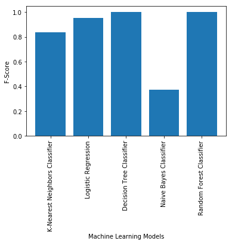
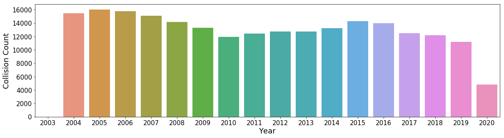
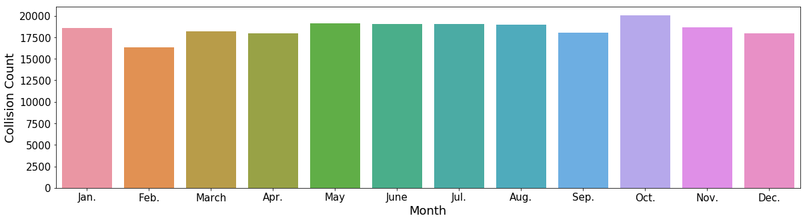
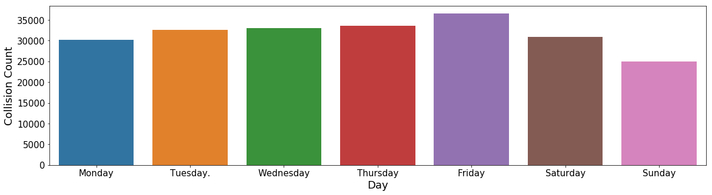
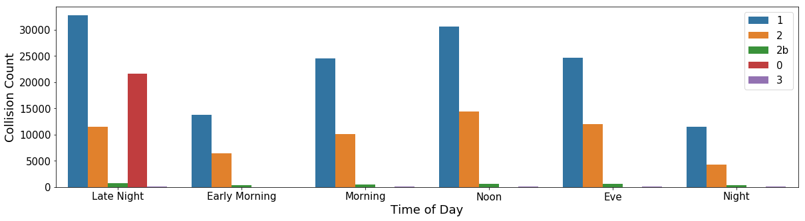
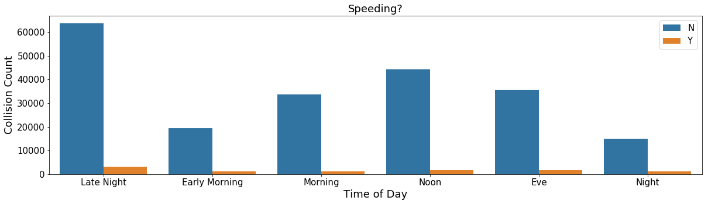

# Seattle Collisions Data Analysis
# Problem description:

In this repository, machine learning algorithms have been developed to predict accident severity using Seattle collisions data. 
The accident severity varies based on a wide range of factors, including weather conditions, light conditions, speeding, etc. Analysis of collisions data enables us to determine the severity of road accidents under different conditions. Therefore, restrict regulations or warning systems can be designed to reduce road traffic injuries and fatalities under high-risk circumstances.  
This repository includes:

Data_Understanding.ipynb : Describing the columns in the dataset.

Data_Visualization.ipynb : Visualizing different features affecting the collision severity.

Predictive_Models.ipynb : Fitting machine learning algorithms to the dataset to predict the collision severity.

# Data description:

City of Seattle has released an open source dataset containing all types of collision since 2014 to present. This dataset is updated weekly.

The dataset contains 221738 rows, each of them reperesents a collision sample. Also, it contains 40 columns:
  - 39 features (independent variables), and 
  - "SEVERITYCODE" as the dependent variable which is going to be predicted based on the provided features.
  
 In this dataset, the accident severity ("SEVERITYCODE") is divided to 5 categories:
  - 0: Unknown
  - 1: Property Damage Only Collision
  - 2: Injury Collision	
  - 2b: Serious Injury Collision	
  - 3: Fatality Collision
  
 # Data pre-processing:
 
 The following actions have been performed to preprocess the data before feeding it to the models:
  - feature selection, removing non-relevant columns to the prediction task, avoiding multicollinearity
  - removing NULL or NaN values if it is needed
  - converting categorical variables to numerical variables
  - performing standardization to bring the features on the same scale
  - balancing the data (different accident severity types have different number of samples in the dataset)
 
 # Methodology:
 
To predict accident severity using Saettle collisions data, following machine learning algorithms have been employed to classify the accident severity as one of 5 existing categories:
  - K-Nearest Neighbors (KNN)
  - Decision Tree
  - Naive Bayes
  - Random Forest
  - Logistic Regression
 
 # Results:
 
 In the following, the result of meachine learning algorithms and some of the features are visualized:
 
 
 
 
 
 
 
 
 
